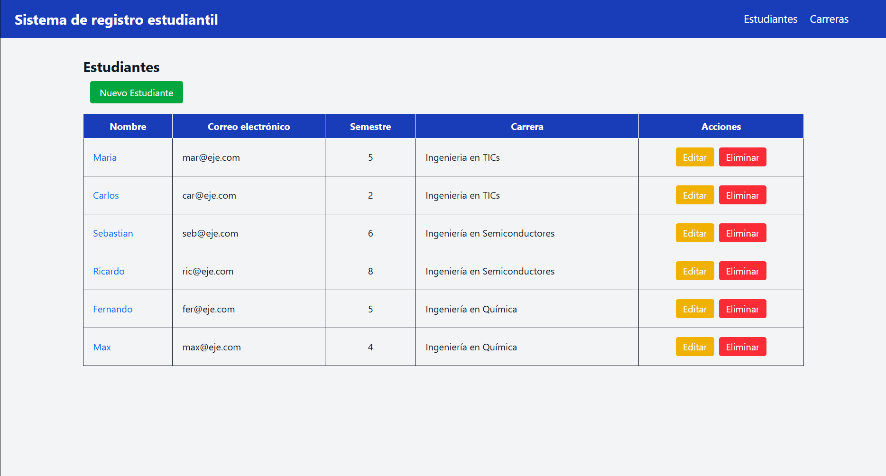

# 🏝️ Proyecto: CRUD de estudiantes

En este proyecto se desarrollara un CRUD completo (Create, Read, Update, Delete) para gestionar Listas de Estudiantes y Carreras utilizando Laravel 12 y Tailwind CSS. Se deberá implementar el sistema de forma funcional, permitiendo registrar, editar, visualizar y eliminar estudiantes además de carreras dentro de una base de datos.

El objetivo es poner en práctica los conocimientos sobre rutas, controladores, migraciones, modelos, relaciones y vistas, aplicando la estructura MVC de Laravel.

# Estructura del CRUD

En la página principal esta una tabla que contiene todos los datos de los regitros de los estudiantes: Nombre, Correo electrónico, Semestre, Carrera y un apartado de acciones. En la parte de arriba hay un boton que lleva a una vista para crear un nuevo registro de estudiante con cada campo necesario, en el apartado de carrera se selecciona una de la lista de las que ya esten creadas.

Dentro de la tabla, en la columna de acciones, hay dos botones: uno para editar el registro de estudiante que te lleva a un form idéntico al de creación pero con todos los campos ya rellenados con la información del estudiante seleccionado y uno para eliminar completamente el registro.

Para el caso de carrera es igual, se puede cambiar a su index por medio de la barra de navegación, solo que esta vez solo es una tabla con columnas como: Nombre, Descripción y Acciones. Funciona y tiene el diseño exactamente igual que el de estudiantes.

---

## 📖 Descripción general

### 🧩 Vista previa del proyecto

---

### 🔗 Enlaces del proyecto

- **Repositorio en GitHub:** [Link del repositorio](https://github.com/ArantzaGHdz/Ejercicio_CRUDdeEstudiantes)
- **Sitio desplegado (opcional):** [Link del deploy](https://ejercicio-loopstudios-landing-page.vercel.app)

---

## 🧠 Proceso de desarrollo

### 🛠️ Tecnologías utilizadas

- [Laravel 12](https://laravel.com)
- [Tailwind CSS](https://tailwindcss.com/)
- PHP
- Laragon
- MySQL
- HTML5 semántico

---

### 💡 Lo que aprendí

Para este proyecto tuve que aprender a utilizar Laragon para configurar y crear la base de datos además de conocer PHP para hacer la página funcional con: la creación de las migraciones, con sus repsectivos factories, modelos y seeder para rellenar los campos de información; la configuración de los controladores que manejan las funciones para crear, visualizar, editar y eliminar los registros para cada tabla creada en la base de datos; y la implementación de las rutas. Continue con mi reforzamiento de conocimientos sobre HTML, CSS y Tailwind.

---

### 🚀 Áreas de mejora

Considero que faltan algunas cosas que perfeccionar en cuanto al elemento CRUD de la página dentro del ámbito visual y funcional, como quizás algunos problemas que puedan surgir al momento de eliminar una carrera y la posible repercusión que tenga en los registros de estudiantes que la tengan seleccionada. También hay algunas funcionalidades que se pueden implementar que puede servir para mejorar la experiencia de los usuarios como selección multiple de registros para eliminar o busqueda con filtros, pero estos son elementos que no eran necesarios para el ejercicio.

---

### 📚 Recursos útiles

- [Documentación oficial de Laravel](https://laravel.com/docs/13.x)
- [Guía oficial de Tailwind CSS](https://tailwindcss.com/docs)

---

### 👩‍💻 Autor

- **Nombre completo:** Arantza Darina Gómez Hernández
- **Carrera:** Ingeniería en Tecnologías de la Información y las Comunicaciones
- **Grupo:** TC1
- **Correo institucional:** 23151198@aguascalientes.tecnm.mx

---

### ✨ Reflexión final

- ¿Qué fue lo más fácil o lo más difícil de realizar?
  Lo más fácil fue el diseño, fue simple de crear; lo más dificil fue los controladores y, sorprendentemente, las rutas. Para lo priemro me base en el ejercicio que hicimos en clase pero algunas veces tuve que consultar en páginas web para guiarme y con lo segundo no debería haber sido complicado ya que solamente es modificar el hipervinculo con la asignación de cada vista necesaria; pero por alguna razón la ruta de creación para nuevo estudiante me daba error 404 y tuve que consultar con un compañero que me dijo que la tenía exactamente igual a mí pero con él no había problema. Al final, tuve que cambiar la estructura del hipervinculo pero sigo sin entender cual es el problema.

- ¿Qué parte disfrutaste más del desarrollo?
  El diseño pero también estuvo la creación de la base de datos junto con las migraciones.

- ¿Qué conceptos nuevos aprendiste?
  Conceptos de Laravel como migraciones, factories, seeders, views, modelos, controladores y rutas.

- ¿Cómo aplicarías lo aprendido en proyectos futuros?
  Ahora siento que tengo las bases del framework de Laravel y, gracias a ello, puedo realizar proyectos un poco más complejos.
